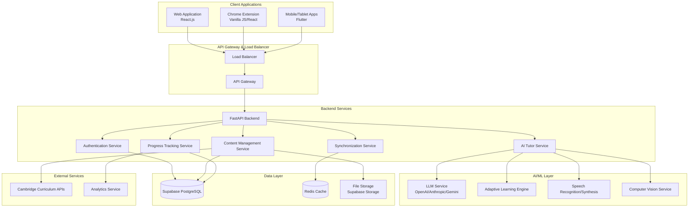

# Design Document

## Overview

The Cambridge AI Tutor is a comprehensive educational platform that leverages artificial intelligence to support Cambridge primary curriculum learning. The system consists of three main client applications (web app, Chrome extension, and mobile/tablet apps) backed by a unified API service. The platform uses advanced LLM capabilities for personalized tutoring, adaptive learning algorithms for content customization, and real-time synchronization across all devices.

The architecture follows a microservices approach with clear separation of concerns, enabling scalability and maintainability. The system integrates with existing infrastructure patterns found in the codebase, utilizing Supabase for data persistence, Redis for caching and real-time features, and FastAPI for robust API development.

## Architecture

### High-Level Architecture



### Service Architecture

The backend follows a modular architecture pattern similar to the existing codebase structure:

- **Core API Layer**: FastAPI application with routers for each service domain
- **Service Layer**: Business logic encapsulated in service classes
- **Data Access Layer**: Repository pattern for database operations
- **AI Integration Layer**: Unified interface for various AI services
- **Authentication Layer**: Supabase Auth integration with role-based access control

## Components and Interfaces

### 1. AI Tutor Service

**Purpose**: Core AI-powered tutoring functionality with personalized explanations and interactive learning support.

**Key Components**:
- `TutorEngine`: Main orchestrator for AI interactions
- `CurriculumAligner`: Ensures content alignment with Cambridge standards
- `PersonalizationEngine`: Adapts responses based on user profile and learning history
- `ConversationManager`: Manages multi-turn conversations and context

**Interfaces**:
```python
class TutorService:
    async def ask_question(self, user_id: str, question: str, context: dict) -> TutorResponse
    async def explain_concept(self, concept_id: str, difficulty_level: int, learning_style: str) -> Explanation
    async def generate_practice_problems(self, topic_id: str, count: int, difficulty: int) -> List[Problem]
    async def provide_feedback(self, answer: str, expected: str, context: dict) -> Feedback
```

### 2. Content Management Service

**Purpose**: Manages curriculum-aligned educational content, lessons, and assessments.

**Key Components**:
- `CurriculumMapper`: Maps content to Cambridge curriculum objectives
- `ContentGenerator`: AI-powered content creation and adaptation
- `AssessmentEngine`: Creates and evaluates practice exercises
- `MediaManager`: Handles images, videos, and interactive content

**Interfaces**:
```python
class ContentService:
    async def get_lesson_content(self, lesson_id: str, user_level: int) -> LessonContent
    async def search_content(self, query: str, filters: dict) -> List[ContentItem]
    async def generate_adaptive_content(self, user_id: str, topic: str) -> AdaptiveContent
    async def validate_curriculum_alignment(self, content_id: str) -> AlignmentReport
```

### 3. Progress Tracking Service

**Purpose**: Monitors learning progress, identifies strengths/weaknesses, and generates insights.

**Key Components**:
- `ProgressAnalyzer`: Analyzes learning patterns and performance
- `ReportGenerator`: Creates visual progress reports for parents
- `RecommendationEngine`: Suggests next learning steps
- `PerformancePredictor`: Predicts learning outcomes and identifies at-risk areas

**Interfaces**:
```python
class ProgressService:
    async def track_activity(self, user_id: str, activity: LearningActivity) -> None
    async def get_progress_report(self, user_id: str, timeframe: str) -> ProgressReport
    async def analyze_performance(self, user_id: str, subject: str) -> PerformanceAnalysis
    async def get_recommendations(self, user_id: str) -> List[Recommendation]
```

### 4. Synchronization Service

**Purpose**: Ensures seamless data synchronization across all platforms and devices.

**Key Components**:
- `SyncManager`: Orchestrates data synchronization
- `ConflictResolver`: Handles data conflicts during sync
- `OfflineManager`: Manages offline data and queue operations
- `RealtimeUpdater`: Provides real-time updates using WebSockets

**Interfaces**:
```python
class SyncService:
    async def sync_user_data(self, user_id: str, device_id: str) -> SyncResult
    async def handle_offline_queue(self, user_id: str, queued_operations: List[Operation]) -> None
    async def broadcast_update(self, user_id: str, update: DataUpdate) -> None
    async def resolve_conflicts(self, conflicts: List[DataConflict]) -> Resolution
```

### 5. Authentication & User Management

**Purpose**: Handles user authentication, authorization, and profile management with child safety features.

**Key Components**:
- `AuthManager`: Integrates with Supabase Auth
- `ProfileManager`: Manages user profiles and preferences
- `ParentalControls`: Implements child safety and parental oversight
- `SessionManager`: Handles multi-device sessions

**Interfaces**:
```python
class AuthService:
    async def authenticate_user(self, credentials: dict) -> AuthResult
    async def create_child_profile(self, parent_id: str, child_data: dict) -> ChildProfile
    async def verify_parental_consent(self, parent_id: str, action: str) -> bool
    async def manage_session(self, user_id: str, device_info: dict) -> Session
```

## Data Models

### Core Entities

```python
# User Management
class User(BaseModel):
    user_id: str
    email: str
    role: UserRole  # PARENT, CHILD, ADMIN
    created_at: datetime
    profile: UserProfile

class ChildProfile(BaseModel):
    child_id: str
    parent_id: str
    name: str
    age: int
    grade_level: int
    learning_preferences: dict
    curriculum_progress: dict
    safety_settings: dict

# Educational Content
class CurriculumTopic(BaseModel):
    topic_id: str
    subject: Subject  # MATH, ESL, SCIENCE
    grade_level: int
    cambridge_code: str
    title: str
    description: str
    prerequisites: List[str]
    learning_objectives: List[str]

class LearningActivity(BaseModel):
    activity_id: str
    user_id: str
    topic_id: str
    activity_type: ActivityType
    content: dict
    started_at: datetime
    completed_at: Optional[datetime]
    performance_data: dict

# AI Interactions
class TutorSession(BaseModel):
    session_id: str
    user_id: str
    started_at: datetime
    ended_at: Optional[datetime]
    messages: List[TutorMessage]
    context: dict
    learning_outcomes: List[str]

class TutorMessage(BaseModel):
    message_id: str
    session_id: str
    sender: MessageSender  # USER, TUTOR
    content: str
    message_type: MessageType  # TEXT, VOICE, IMAGE
    timestamp: datetime
    metadata: dict

# Progress Tracking
class ProgressRecord(BaseModel):
    record_id: str
    user_id: str
    topic_id: str
    skill_level: float
    confidence_score: float
    last_practiced: datetime
    mastery_indicators: dict
    improvement_areas: List[str]
```

### Database Schema Design

The database schema leverages Supabase PostgreSQL with Row Level Security (RLS) for data protection:

```sql
-- Users and Authentication (extends Supabase auth.users)
CREATE TABLE user_profiles (
    user_id UUID PRIMARY KEY REFERENCES auth.users(id),
    role user_role NOT NULL,
    created_at TIMESTAMP WITH TIME ZONE DEFAULT NOW(),
    updated_at TIMESTAMP WITH TIME ZONE DEFAULT NOW()
);

-- Child profiles with parental controls
CREATE TABLE child_profiles (
    child_id UUID PRIMARY KEY DEFAULT gen_random_uuid(),
    parent_id UUID NOT NULL REFERENCES user_profiles(user_id),
    name VARCHAR(100) NOT NULL,
    age INTEGER NOT NULL CHECK (age >= 5 AND age <= 12),
    grade_level INTEGER NOT NULL,
    learning_preferences JSONB DEFAULT '{}',
    curriculum_progress JSONB DEFAULT '{}',
    safety_settings JSONB DEFAULT '{}',
    created_at TIMESTAMP WITH TIME ZONE DEFAULT NOW()
);

-- Curriculum structure
CREATE TABLE curriculum_topics (
    topic_id UUID PRIMARY KEY DEFAULT gen_random_uuid(),
    subject subject_type NOT NULL,
    grade_level INTEGER NOT NULL,
    cambridge_code VARCHAR(50) NOT NULL,
    title VARCHAR(200) NOT NULL,
    description TEXT,
    prerequisites UUID[] DEFAULT '{}',
    learning_objectives TEXT[] DEFAULT '{}',
    content_metadata JSONB DEFAULT '{}'
);

-- Learning activities and interactions
CREATE TABLE learning_activities (
    activity_id UUID PRIMARY KEY DEFAULT gen_random_uuid(),
    user_id UUID NOT NULL REFERENCES child_profiles(child_id),
    topic_id UUID NOT NULL REFERENCES curriculum_topics(topic_id),
    activity_type activity_type NOT NULL,
    content JSONB NOT NULL,
    started_at TIMESTAMP WITH TIME ZONE DEFAULT NOW(),
    completed_at TIMESTAMP WITH TIME ZONE,
    performance_data JSONB DEFAULT '{}'
);

-- AI tutor sessions
CREATE TABLE tutor_sessions (
    session_id UUID PRIMARY KEY DEFAULT gen_random_uuid(),
    user_id UUID NOT NULL REFERENCES child_profiles(child_id),
    started_at TIMESTAMP WITH TIME ZONE DEFAULT NOW(),
    ended_at TIMESTAMP WITH TIME ZONE,
    context JSONB DEFAULT '{}',
    learning_outcomes TEXT[] DEFAULT '{}'
);

-- Progress tracking
CREATE TABLE progress_records (
    record_id UUID PRIMARY KEY DEFAULT gen_random_uuid(),
    user_id UUID NOT NULL REFERENCES child_profiles(child_id),
    topic_id UUID NOT NULL REFERENCES curriculum_topics(topic_id),
    skill_level DECIMAL(3,2) CHECK (skill_level >= 0 AND skill_level <= 1),
    confidence_score DECIMAL(3,2) CHECK (confidence_score >= 0 AND confidence_score <= 1),
    last_practiced TIMESTAMP WITH TIME ZONE DEFAULT NOW(),
    mastery_indicators JSONB DEFAULT '{}',
    improvement_areas TEXT[] DEFAULT '{}'
);
```

## Error Handling

### Error Classification

1. **User Input Errors**: Invalid questions, inappropriate content
2. **AI Service Errors**: LLM API failures, timeout issues
3. **Data Consistency Errors**: Sync conflicts, validation failures
4. **Authentication Errors**: Invalid credentials, expired sessions
5. **System Errors**: Database failures, network issues

### Error Handling Strategy

```python
class TutorError(Exception):
    """Base exception for tutor-related errors"""
    pass

class ContentModerationError(TutorError):
    """Raised when content fails safety checks"""
    pass

class CurriculumAlignmentError(TutorError):
    """Raised when content doesn't align with curriculum"""
    pass

# Error handling middleware
@app.middleware("http")
async def error_handling_middleware(request: Request, call_next):
    try:
        response = await call_next(request)
        return response
    except TutorError as e:
        logger.error(f"Tutor error: {str(e)}")
        return JSONResponse(
            status_code=400,
            content={"error": "tutor_error", "message": str(e)}
        )
    except Exception as e:
        logger.error(f"Unexpected error: {str(e)}")
        return JSONResponse(
            status_code=500,
            content={"error": "internal_error", "message": "An unexpected error occurred"}
        )
```

### Graceful Degradation

- **AI Service Unavailable**: Fall back to pre-generated content and cached responses
- **Network Issues**: Enable offline mode with local caching
- **Database Failures**: Use Redis for temporary data storage
- **Speech Recognition Failures**: Provide text-based alternatives

## Testing Strategy

### Testing Pyramid

1. **Unit Tests** (70%):
   - Service layer logic
   - Data model validation
   - AI response processing
   - Curriculum alignment algorithms

2. **Integration Tests** (20%):
   - API endpoint testing
   - Database operations
   - AI service integration
   - Cross-platform synchronization

3. **End-to-End Tests** (10%):
   - Complete user workflows
   - Multi-device synchronization
   - Parent-child interaction flows
   - Performance under load

### AI-Specific Testing

```python
# Example test for AI tutor responses
class TestTutorService:
    async def test_age_appropriate_explanations(self):
        """Test that explanations are appropriate for child's age"""
        tutor = TutorService()
        response = await tutor.explain_concept(
            concept_id="fractions_basic",
            age=7,
            learning_style="visual"
        )
        
        assert response.reading_level <= 2  # Grade 2 level
        assert "fraction" in response.content.lower()
        assert len(response.visual_aids) > 0
    
    async def test_curriculum_alignment(self):
        """Test that generated content aligns with Cambridge curriculum"""
        content = await ContentService.generate_practice_problems(
            topic_id="multiplication_tables",
            grade_level=3,
            count=5
        )
        
        for problem in content.problems:
            assert problem.cambridge_alignment is not None
            assert problem.difficulty_level <= 3
```

### Safety and Content Moderation Testing

- **Content Safety**: Automated testing for inappropriate content detection
- **Privacy Compliance**: Verification of COPPA and GDPR compliance
- **Parental Controls**: Testing of access restrictions and monitoring features
- **Data Encryption**: Validation of data protection measures

### Performance Testing

- **Response Time**: AI responses within 3-second requirement
- **Concurrent Users**: Support for multiple children per family
- **Cross-Platform Sync**: Real-time synchronization testing
- **Offline Functionality**: Validation of offline mode capabilities

The testing strategy ensures reliability, safety, and performance across all components while maintaining the educational quality and curriculum alignment that parents and children depend on.