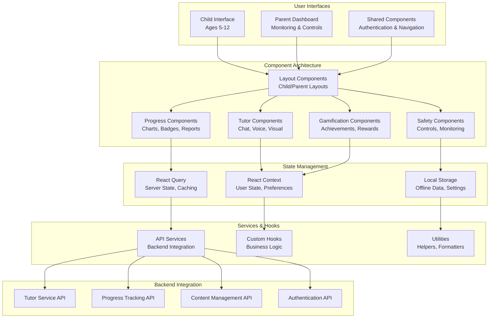

# Design Document

## Overview

The Cambridge AI Tutor Frontend Design transforms the existing Suna AI interface into a specialized educational platform optimized for children aged 5-12 and their parents. The design leverages the existing React.js and TypeScript infrastructure while introducing new components, layouts, and user experience patterns specifically tailored for educational use.

The frontend architecture maintains the current technical foundation (React, TypeScript, Tailwind CSS, Next.js) while implementing child-friendly design systems, educational interaction patterns, and comprehensive parental oversight features. The design ensures seamless integration with the existing backend services while providing distinct user experiences for children and parents.

## Architecture

### High-Level Frontend Architecture



### Component Hierarchy

The frontend follows a hierarchical component structure optimized for educational use:

```
src/
├── app/
│   ├── (child)/                    # Child-specific routes
│   │   ├── learn/                  # Learning interface
│   │   ├── progress/               # Child progress view
│   │   └── games/                  # Gamification features
│   ├── (parent)/                   # Parent-specific routes
│   │   ├── dashboard/              # Parent dashboard
│   │   ├── settings/               # Parental controls
│   │   └── reports/                # Progress reports
│   └── (shared)/                   # Shared routes
│       ├── auth/                   # Authentication
│       └── profile/                # Profile management
├── components/
│   ├── child/                      # Child-specific components
│   │   ├── tutor/                  # AI tutor interface
│   │   ├── learning/               # Learning activities
│   │   └── games/                  # Gamification elements
│   ├── parent/                     # Parent-specific components
│   │   ├── dashboard/              # Dashboard components
│   │   ├── monitoring/             # Child monitoring
│   │   └── controls/               # Safety controls
│   ├── shared/                     # Shared components
│   │   ├── ui/                     # Base UI components
│   │   ├── layout/                 # Layout components
│   │   └── auth/                   # Authentication components
│   └── tutor/                      # Core tutor components
│       ├── chat/                   # Chat interface
│       ├── voice/                  # Voice interaction
│       └── visual/                 # Visual learning aids
├── hooks/                          # Custom React hooks
│   ├── use-tutor.ts               # Tutor interaction logic
│   ├── use-progress.ts            # Progress tracking
│   ├── use-gamification.ts        # Gamification logic
│   └── use-safety.ts              # Safety and parental controls
├── services/                       # API services
│   ├── tutor-service.ts           # AI tutor API
│   ├── progress-service.ts        # Progress tracking API
│   ├── content-service.ts         # Content management API
│   └── auth-service.ts            # Authentication API
├── contexts/                       # React contexts
│   ├── UserContext.tsx            # User state management
│   ├── TutorContext.tsx           # Tutor session state
│   └── SafetyContext.tsx          # Safety settings state
├── styles/                         # Styling and themes
│   ├── child-theme.css            # Child interface theme
│   ├── parent-theme.css           # Parent interface theme
│   └── components.css             # Component-specific styles
└── utils/                          # Utility functions
    ├── age-appropriate.ts         # Age-appropriate content helpers
    ├── curriculum-helpers.ts      # Cambridge curriculum utilities
    └── safety-helpers.ts          # Safety and filtering utilities
```

## Components and Interfaces

### 1. Child Interface Components

#### TutorChat Component
**Purpose**: Main AI tutor interaction interface optimized for children

**Key Features**:
- Large, colorful message bubbles with child-friendly typography
- Visual indicators for AI thinking/processing states
- Integrated voice interaction with clear speaking/listening cues
- Interactive elements like buttons for common questions
- Visual aids and diagrams embedded in responses

**Interface**:
```typescript
interface TutorChatProps {
  childId: string;
  subject?: 'math' | 'esl' | 'science';
  onQuestionAsked?: (question: string) => void;
  onResponseReceived?: (response: TutorResponse) => void;
}

interface TutorResponse {
  id: string;
  content: string;
  visualAids?: VisualAid[];
  interactiveElements?: InteractiveElement[];
  ageAppropriate: boolean;
  curriculumAligned: boolean;
}
```

#### LearningProgress Component
**Purpose**: Child-friendly progress visualization with gamification

**Key Features**:
- Animated progress bars and achievement badges
- Subject-specific visual themes (Math: numbers/shapes, ESL: books/words, Science: experiments)
- Milestone celebrations with confetti animations
- Personal best tracking and encouragement messages
- Visual learning path with unlocked/locked content indicators

**Interface**:
```typescript
interface LearningProgressProps {
  childId: string;
  subject?: Subject;
  showAnimations?: boolean;
  onMilestoneReached?: (milestone: Milestone) => void;
}

interface ProgressData {
  overallProgress: number;
  subjectProgress: Record<Subject, SubjectProgress>;
  achievements: Achievement[];
  currentStreak: number;
  nextMilestone: Milestone;
}
```

#### GameElements Component
**Purpose**: Gamification features integrated throughout the learning experience

**Key Features**:
- Point counters with animated increments
- Badge collection display with rarity indicators
- Achievement unlock animations and celebrations
- Learning streaks and consistency rewards
- Personalized challenges based on learning patterns

**Interface**:
```typescript
interface GameElementsProps {
  childId: string;
  currentPoints: number;
  recentAchievements: Achievement[];
  onAchievementUnlocked?: (achievement: Achievement) => void;
}

interface Achievement {
  id: string;
  title: string;
  description: string;
  icon: string;
  rarity: 'common' | 'rare' | 'epic' | 'legendary';
  unlockedAt: Date;
  category: 'progress' | 'consistency' | 'mastery' | 'effort';
}
```

### 2. Parent Interface Components

#### ParentDashboard Component
**Purpose**: Comprehensive overview of child's learning progress and platform usage

**Key Features**:
- Multi-child support with easy switching between profiles
- Weekly/monthly progress summaries with trend analysis
- Recent activity timeline with detailed interaction logs
- AI-generated insights and recommendations for parents
- Quick access to safety settings and controls

**Interface**:
```typescript
interface ParentDashboardProps {
  parentId: string;
  selectedChildId?: string;
  timeframe?: 'week' | 'month' | 'term';
  onChildSelected?: (childId: string) => void;
}

interface DashboardData {
  children: ChildProfile[];
  selectedChild: ChildProfile;
  progressSummary: ProgressSummary;
  recentActivity: ActivityLog[];
  aiInsights: ParentInsight[];
  safetyAlerts: SafetyAlert[];
}
```

#### SafetyControls Component
**Purpose**: Comprehensive parental controls and safety management

**Key Features**:
- Content filtering settings with age-appropriate presets
- Time limit configuration with flexible scheduling
- Activity monitoring with real-time alerts
- Communication oversight with conversation review
- Emergency controls for immediate platform restrictions

**Interface**:
```typescript
interface SafetyControlsProps {
  childId: string;
  currentSettings: SafetySettings;
  onSettingsChanged?: (settings: SafetySettings) => void;
}

interface SafetySettings {
  contentFiltering: 'strict' | 'moderate' | 'relaxed';
  timeLimit: TimeLimitSettings;
  allowedSubjects: Subject[];
  voiceInteractionEnabled: boolean;
  parentalApprovalRequired: boolean;
  activityMonitoring: MonitoringLevel;
}
```

#### ProgressReports Component
**Purpose**: Detailed progress reports and analytics for parents

**Key Features**:
- Interactive charts showing learning trends over time
- Subject-specific performance breakdowns
- Comparison with Cambridge curriculum expectations
- Downloadable reports for school communication
- Actionable recommendations for home support

**Interface**:
```typescript
interface ProgressReportsProps {
  childId: string;
  reportType: 'summary' | 'detailed' | 'curriculum';
  dateRange: DateRange;
  onReportGenerated?: (report: ProgressReport) => void;
}

interface ProgressReport {
  id: string;
  childId: string;
  generatedAt: Date;
  timeframe: DateRange;
  overallSummary: string;
  subjectBreakdowns: SubjectBreakdown[];
  recommendations: Recommendation[];
  curriculumAlignment: CurriculumAlignment;
}
```

### 3. Shared Components

#### AuthenticationFlow Component
**Purpose**: Age-appropriate authentication and profile selection

**Key Features**:
- Visual profile selection for children with photos/avatars
- Simplified login flow with large buttons and clear instructions
- Parental verification for sensitive actions
- Multi-factor authentication for parent accounts
- Session management with automatic timeout for child safety

#### NavigationLayout Component
**Purpose**: Adaptive navigation system for different user types

**Key Features**:
- Child-friendly navigation with large icons and minimal text
- Parent navigation with comprehensive menu options
- Breadcrumb navigation for complex workflows
- Quick access to emergency controls and help
- Responsive design adapting to different screen sizes

## Data Models

### Frontend State Models

```typescript
// User Management
interface ChildUser {
  id: string;
  name: string;
  age: number;
  gradeLevel: number;
  avatar: string;
  preferences: ChildPreferences;
  currentSession?: TutorSession;
  safetySettings: SafetySettings;
}

interface ParentUser {
  id: string;
  email: string;
  name: string;
  children: ChildUser[];
  preferences: ParentPreferences;
  subscriptionStatus: SubscriptionStatus;
}

// Learning Session State
interface TutorSession {
  id: string;
  childId: string;
  subject: Subject;
  startedAt: Date;
  messages: ChatMessage[];
  currentContext: LearningContext;
  voiceEnabled: boolean;
  visualAidsEnabled: boolean;
}

interface ChatMessage {
  id: string;
  sender: 'child' | 'tutor';
  content: string;
  timestamp: Date;
  messageType: 'text' | 'voice' | 'visual';
  visualAids?: VisualAid[];
  interactiveElements?: InteractiveElement[];
}

// Progress and Gamification
interface UserProgress {
  childId: string;
  overallLevel: number;
  totalPoints: number;
  currentStreak: number;
  subjectProgress: Record<Subject, SubjectProgress>;
  achievements: Achievement[];
  badges: Badge[];
  lastUpdated: Date;
}

interface SubjectProgress {
  subject: Subject;
  level: number;
  pointsEarned: number;
  topicsCompleted: string[];
  currentTopic: string;
  masteryLevel: number;
  timeSpent: number;
}
```

### API Integration Models

```typescript
// API Request/Response Types
interface TutorQuestionRequest {
  childId: string;
  question: string;
  subject?: Subject;
  context?: LearningContext;
  voiceInput?: boolean;
}

interface TutorQuestionResponse {
  id: string;
  response: string;
  visualAids: VisualAid[];
  followUpQuestions: string[];
  curriculumAlignment: CurriculumReference;
  ageAppropriate: boolean;
  confidenceScore: number;
}

interface ProgressUpdateRequest {
  childId: string;
  activityType: ActivityType;
  subject: Subject;
  topicId: string;
  performanceData: PerformanceMetrics;
  timeSpent: number;
}

interface SafetyCheckRequest {
  content: string;
  childAge: number;
  context: 'question' | 'response' | 'general';
}

interface SafetyCheckResponse {
  isAppropriate: boolean;
  riskLevel: 'low' | 'medium' | 'high';
  flaggedContent?: string[];
  suggestedAlternative?: string;
}
```

## Error Handling

### Child-Friendly Error Handling

The frontend implements specialized error handling designed for children:

```typescript
interface ChildFriendlyError {
  type: 'network' | 'content' | 'safety' | 'technical';
  childMessage: string;
  parentMessage: string;
  recoveryOptions: RecoveryOption[];
  illustration?: string;
}

class ChildErrorHandler {
  static handleTutorError(error: Error, childAge: number): ChildFriendlyError {
    // Convert technical errors into age-appropriate messages
    // Provide visual cues and simple recovery options
    // Log detailed error information for parents and developers
  }
  
  static handleSafetyError(content: string, reason: string): ChildFriendlyError {
    // Gently redirect inappropriate content requests
    // Provide educational alternatives
    // Notify parents discretely without alarming the child
  }
}
```

### Progressive Error Recovery

1. **Immediate Recovery**: Retry failed requests automatically with loading indicators
2. **Graceful Degradation**: Provide cached content when live services are unavailable
3. **User Guidance**: Offer clear, age-appropriate instructions for resolving issues
4. **Parental Notification**: Alert parents to persistent issues without disrupting child experience
5. **Fallback Content**: Display educational games or activities when primary features fail

## Testing Strategy

### Child-Centric Testing Approach

#### Usability Testing with Children
- **Age-Appropriate Testing**: Separate testing protocols for different age groups (5-7, 8-10, 11-12)
- **Observation-Based Testing**: Focus on behavior observation rather than verbal feedback
- **Task-Based Scenarios**: Test common learning workflows and interaction patterns
- **Accessibility Testing**: Ensure compatibility with assistive technologies

#### Parent Experience Testing
- **Dashboard Usability**: Test parent dashboard comprehension and task completion
- **Safety Feature Testing**: Verify parental controls work as expected
- **Report Clarity**: Ensure progress reports are understandable and actionable
- **Multi-Child Management**: Test workflows for families with multiple children

#### Technical Testing Framework

```typescript
// Example test structure for child components
describe('TutorChat Component', () => {
  describe('Child Interaction', () => {
    it('should display age-appropriate responses for 6-year-old', async () => {
      const { getByTestId } = render(
        <TutorChat childId="test-child" age={6} />
      );
      
      // Test age-appropriate content filtering
      // Verify visual elements are child-friendly
      // Check response time meets requirements
    });
    
    it('should handle voice input correctly', async () => {
      // Test voice recognition integration
      // Verify speech-to-text accuracy
      // Check visual feedback during voice interaction
    });
  });
  
  describe('Safety Features', () => {
    it('should block inappropriate content', async () => {
      // Test content filtering
      // Verify parental notification
      // Check graceful error handling
    });
  });
});
```

### Performance Testing

- **Load Time Testing**: Ensure child interface loads within 2 seconds
- **Animation Performance**: Verify smooth animations on various devices
- **Memory Usage**: Test for memory leaks during extended learning sessions
- **Offline Functionality**: Validate cached content availability and sync recovery

### Safety and Compliance Testing

- **Content Moderation**: Automated testing of inappropriate content detection
- **Privacy Compliance**: Verify COPPA and GDPR compliance in data handling
- **Parental Controls**: Test all safety features and access restrictions
- **Data Security**: Validate encryption and secure data transmission

The design ensures a comprehensive, child-friendly educational platform that maintains safety, engagement, and educational effectiveness while providing parents with the oversight and insights they need to support their children's learning journey.