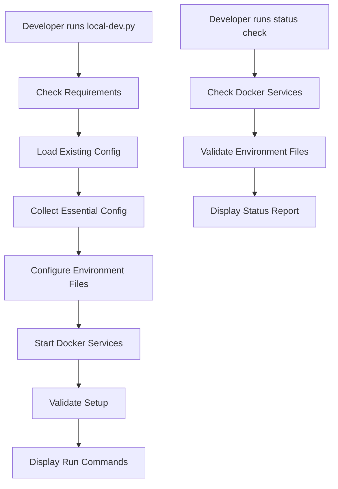

# Design Document

## Overview

The local development configuration system will provide a streamlined setup experience for developers who want to quickly start working on Suna without going through the full production setup wizard. The system will create a new `local-dev.py` script that focuses on essential services only and provides clear instructions for running frontend and backend services locally in separate terminals.

## Architecture

The solution consists of three main components:

1. **Local Development Setup Script** (`local-dev.py`) - A simplified setup wizard focused on local development
2. **Environment Configuration Manager** - Handles creation and validation of local development environment files
3. **Service Status Checker** - Validates Docker services and configuration health



## Components and Interfaces

### LocalDevSetup Class

The main orchestrator for the local development setup process.

```python
class LocalDevSetup:
    def __init__(self):
        self.config = {}
        self.required_services = ['supabase', 'llm']
        self.optional_services = ['search', 'rapidapi', 'qstash', 'slack', 'pipedream']
    
    def run(self) -> None
    def check_requirements(self) -> bool
    def collect_essential_config(self) -> None
    def configure_environment_files(self) -> None
    def start_docker_services(self) -> None
    def validate_setup(self) -> bool
    def display_run_commands(self) -> None
```

### EnvironmentManager Class

Handles creation and management of environment files for local development.

```python
class EnvironmentManager:
    def __init__(self, config: dict):
        self.config = config
        self.backend_env_path = "backend/.env"
        self.frontend_env_path = "frontend/.env.local"
    
    def backup_existing_files(self) -> None
    def create_backend_env(self) -> None
    def create_frontend_env(self) -> None
    def validate_env_files(self) -> bool
```

### DockerServiceManager Class

Manages Docker services required for local development.

```python
class DockerServiceManager:
    def __init__(self):
        self.required_services = ['redis', 'rabbitmq']
    
    def check_docker_available(self) -> bool
    def start_services(self) -> bool
    def check_service_health(self, service_name: str) -> bool
    def get_service_status(self) -> dict
```

### StatusChecker Class

Provides comprehensive status checking for the local development environment.

```python
class StatusChecker:
    def __init__(self):
        self.env_manager = EnvironmentManager({})
        self.docker_manager = DockerServiceManager()
    
    def check_all(self) -> dict
    def check_configuration(self) -> dict
    def check_docker_services(self) -> dict
    def display_status_report(self, status: dict) -> None
```

## Data Models

### Configuration Schema

```python
LocalDevConfig = {
    "supabase": {
        "url": str,
        "anon_key": str,
        "service_role_key": str
    },
    "llm": {
        "provider": str,  # "openai", "anthropic", "gemini", "openrouter"
        "api_key": str,
        "model": str
    },
    "optional": {
        "search": {
            "tavily_key": str,
            "firecrawl_key": str
        },
        "daytona": {
            "api_key": str
        }
    }
}
```

### Environment File Templates

**Backend Environment Template:**
```bash
# Local Development Configuration
ENV_MODE=local

# Database (Required)
SUPABASE_URL={supabase_url}
SUPABASE_ANON_KEY={supabase_anon_key}
SUPABASE_SERVICE_ROLE_KEY={supabase_service_role_key}

# Infrastructure (Local Docker)
REDIS_HOST=localhost
REDIS_PORT=6379
REDIS_PASSWORD=
REDIS_SSL=false
RABBITMQ_HOST=localhost
RABBITMQ_PORT=5672

# LLM Provider (Required)
{llm_provider}_API_KEY={llm_api_key}
MODEL_TO_USE={model_name}

# Optional Services (can be empty for local dev)
TAVILY_API_KEY={tavily_key}
FIRECRAWL_API_KEY={firecrawl_key}
FIRECRAWL_URL=https://api.firecrawl.dev
DAYTONA_API_KEY={daytona_key}
DAYTONA_SERVER_URL=https://app.daytona.io/api
DAYTONA_TARGET=us

# MCP Configuration
MCP_CREDENTIAL_ENCRYPTION_KEY={generated_key}
```

**Frontend Environment Template:**
```bash
# Local Development Configuration
NEXT_PUBLIC_ENV_MODE=LOCAL
NEXT_PUBLIC_SUPABASE_URL={supabase_url}
NEXT_PUBLIC_SUPABASE_ANON_KEY={supabase_anon_key}
NEXT_PUBLIC_BACKEND_URL=http://localhost:8000/api
NEXT_PUBLIC_URL=http://localhost:3000
```

## Error Handling

### Configuration Errors
- Missing required environment variables
- Invalid API key formats
- Unreachable service URLs
- File permission issues

### Docker Service Errors
- Docker not installed or not running
- Port conflicts (6379, 5672 already in use)
- Service startup failures
- Health check timeouts

### Recovery Strategies
- Automatic backup of existing configuration files
- Rollback capability if setup fails
- Clear error messages with suggested fixes
- Retry mechanisms for transient failures

## Testing Strategy

### Unit Tests
- Configuration validation logic
- Environment file generation
- Docker service management
- Status checking functionality

### Integration Tests
- End-to-end setup process
- Docker service interaction
- Environment file creation and validation
- Error handling scenarios

### Manual Testing Scenarios
1. Fresh installation on clean system
2. Updating existing configuration
3. Handling missing Docker installation
4. Port conflict resolution
5. Invalid API key handling
6. Service startup failures

## Implementation Details

### File Structure
```
local-dev.py                 # Main setup script
local-dev-status.py         # Status checking script
utils/
  ├── local_dev_setup.py    # LocalDevSetup class
  ├── env_manager.py        # EnvironmentManager class
  ├── docker_manager.py     # DockerServiceManager class
  └── status_checker.py     # StatusChecker class
```

### Command Line Interface

**Setup Command:**
```bash
python local-dev.py
```

**Status Command:**
```bash
python local-dev-status.py
```

**Setup with Options:**
```bash
python local-dev.py --skip-optional  # Skip all optional services
python local-dev.py --reset          # Reset existing configuration
```

### Terminal Output Examples

**Successful Setup Output:**
```
🚀 Suna Local Development Setup Complete!

To start your development environment:

Backend (Terminal 1):
  cd backend
  docker compose up redis rabbitmq -d
  uv run api.py

Worker (Terminal 2):
  cd backend
  uv run dramatiq --processes 4 --threads 4 run_agent_background

Frontend (Terminal 3):
  cd frontend
  npm install
  npm run dev

Your services will be available at:
  - Frontend: http://localhost:3000
  - Backend API: http://localhost:8000/api
  - Redis: localhost:6379
  - RabbitMQ: localhost:5672 (Management: http://localhost:15672)
```

**Status Check Output:**
```
📊 Suna Local Development Status

Configuration:
  ✅ Backend environment file
  ✅ Frontend environment file
  ✅ Supabase configuration
  ✅ LLM provider (OpenAI)
  ⚠️  Search APIs not configured (optional)

Docker Services:
  ✅ Docker daemon running
  ✅ Redis (localhost:6379)
  ✅ RabbitMQ (localhost:5672)

Ready for development! 🎉
```

## Security Considerations

- API keys are stored in local environment files (not committed to git)
- Environment files are created with restricted permissions (600)
- Backup files are also created with restricted permissions
- No sensitive data is logged or displayed in plain text
- MCP encryption key is automatically generated using secure random bytes

## Performance Considerations

- Docker service health checks with reasonable timeouts
- Minimal configuration prompts (only essentials)
- Fast validation of existing configuration
- Efficient status checking without unnecessary service calls
- Parallel Docker service startup where possible