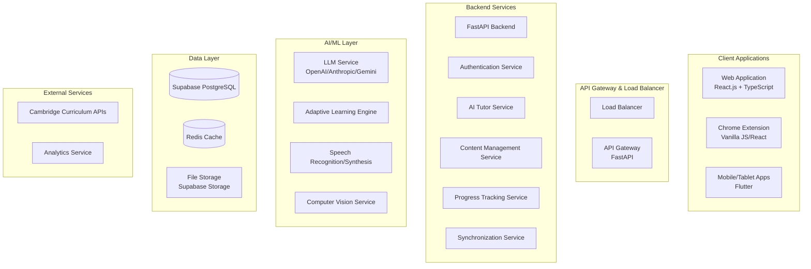
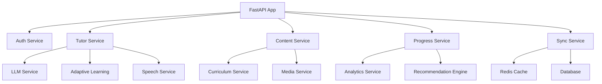

# System Patterns: Cambridge AI Tutor

## Architecture Overview

### High-Level System Architecture

The Cambridge AI Tutor follows a microservices architecture with clear separation of concerns:



### Service Architecture Patterns

#### 1. Repository Pattern
All data access follows the repository pattern for consistency and testability:

```python
class UserRepository:
    async def get_by_id(self, user_id: str) -> Optional[User]
    async def create(self, user: User) -> User
    async def update(self, user: User) -> User
    async def delete(self, user_id: str) -> bool

class ChildProfileRepository:
    async def get_by_parent_id(self, parent_id: str) -> List[ChildProfile]
    async def create_with_safety_checks(self, profile: ChildProfile) -> ChildProfile
    async def update_learning_preferences(self, child_id: str, preferences: dict) -> ChildProfile
```

#### 2. Service Layer Pattern
Business logic encapsulated in service classes with dependency injection:

```python
class TutorService:
    def __init__(
        self,
        llm_service: LLMService,
        curriculum_service: CurriculumService,
        personalization_service: PersonalizationService
    ):
        self.llm_service = llm_service
        self.curriculum_service = curriculum_service
        self.personalization_service = personalization_service
    
    async def ask_question(self, user_id: str, question: str, context: dict) -> TutorResponse:
        # Orchestrate AI response generation with curriculum alignment
        pass
```

#### 3. Event-Driven Architecture
Real-time updates and cross-service communication:

```python
class EventBus:
    async def publish(self, event: DomainEvent) -> None
    async def subscribe(self, event_type: str, handler: Callable) -> None

class LearningActivityCompleted(DomainEvent):
    user_id: str
    activity_id: str
    performance_data: dict
    timestamp: datetime
```

## Key Technical Decisions

### 1. AI Integration Strategy

#### Multi-Provider LLM Support
- **LiteLLM Integration**: Unified interface for OpenAI, Anthropic, and Gemini
- **Fallback Strategy**: Automatic provider switching on failures
- **Response Caching**: Redis-based caching for common queries
- **Quality Validation**: Automated content moderation and curriculum alignment

```python
class LLMService:
    async def generate_response(
        self,
        prompt: str,
        context: dict,
        provider: str = "auto"
    ) -> LLMResponse:
        # Multi-provider orchestration with fallback
        pass
```

#### Curriculum Alignment Engine
- **Cambridge Standards Mapping**: Database-driven curriculum code validation
- **Content Validation**: Automated checks for age-appropriateness
- **Progressive Difficulty**: AI-powered content adaptation
- **Learning Style Adaptation**: Visual, auditory, and kinesthetic approaches

### 2. Data Synchronization Strategy

#### Real-Time Sync Architecture
- **WebSocket Connections**: Live updates across all platforms
- **Conflict Resolution**: Last-write-wins with conflict detection
- **Offline Queue**: Local storage with sync on reconnection
- **Data Versioning**: Optimistic locking for concurrent edits

```python
class SyncService:
    async def sync_user_data(self, user_id: str, device_id: str) -> SyncResult:
        # Real-time synchronization with conflict resolution
        pass
    
    async def handle_offline_queue(self, user_id: str, operations: List[Operation]) -> None:
        # Process queued operations when online
        pass
```

#### Cross-Platform Data Consistency
- **Unified Data Model**: Consistent schemas across all platforms
- **Platform-Specific Adapters**: Handle platform differences
- **Incremental Sync**: Only sync changed data for efficiency
- **State Management**: Centralized state with local caching

### 3. Security and Privacy Patterns

#### Child Safety Framework
- **Content Moderation**: AI-powered inappropriate content detection
- **Age Verification**: Strict age-appropriate content delivery
- **Parental Controls**: Comprehensive oversight and monitoring
- **Data Encryption**: End-to-end encryption for sensitive data

```python
class SafetyService:
    async def validate_content(self, content: str, age: int) -> SafetyResult:
        # Content moderation and age-appropriateness checks
        pass
    
    async def verify_parental_consent(self, parent_id: str, action: str) -> bool:
        # Parental consent verification
        pass
```

#### Privacy Compliance
- **COPPA Compliance**: Child data protection measures
- **GDPR Compliance**: Data portability and deletion rights
- **Data Minimization**: Collect only necessary information
- **Audit Logging**: Comprehensive activity tracking

### 4. Performance Optimization Patterns

#### Caching Strategy
- **Multi-Level Caching**: Redis + local storage
- **Content Caching**: Pre-generated curriculum content
- **Session Caching**: User preferences and context
- **AI Response Caching**: Common question responses

```python
class CacheService:
    async def get_cached_response(self, query_hash: str) -> Optional[TutorResponse]:
        # Multi-level cache lookup
        pass
    
    async def cache_response(self, query_hash: str, response: TutorResponse) -> None:
        # Cache management with TTL
        pass
```

#### Response Time Optimization
- **Async Processing**: Non-blocking operations throughout
- **Connection Pooling**: Database and external service connections
- **Load Balancing**: Distribute requests across multiple instances
- **Graceful Degradation**: Fallback content when AI unavailable

## Component Relationships

### 1. Service Dependencies



### 2. Data Flow Patterns

#### Learning Activity Flow
1. **User Interaction**: Child asks question or completes activity
2. **AI Processing**: Tutor service generates personalized response
3. **Progress Update**: Activity logged and progress calculated
4. **Real-Time Sync**: Updates broadcast to all connected devices
5. **Parent Notification**: Progress insights sent to parent dashboard

#### Content Generation Flow
1. **Curriculum Request**: System requests content for specific topic
2. **AI Generation**: LLM creates curriculum-aligned content
3. **Quality Validation**: Content checked for safety and alignment
4. **Caching**: Validated content stored for future use
5. **Delivery**: Content delivered to user with personalization

### 3. Error Handling Patterns

#### Graceful Degradation
- **AI Service Failures**: Fall back to pre-generated content
- **Network Issues**: Enable offline mode with local caching
- **Database Failures**: Use Redis for temporary data storage
- **Speech Recognition Failures**: Provide text-based alternatives

```python
class ErrorHandlingMiddleware:
    async def handle_ai_failure(self, error: AIError) -> FallbackResponse:
        # Provide cached or pre-generated content
        pass
    
    async def handle_network_failure(self, error: NetworkError) -> OfflineMode:
        # Enable offline functionality
        pass
```

#### Circuit Breaker Pattern
- **External Service Protection**: Prevent cascade failures
- **Automatic Recovery**: Resume normal operation when services recover
- **Monitoring**: Track failure rates and response times
- **Alerting**: Notify operators of service degradation

## Critical Implementation Paths

### 1. AI Tutor Core Implementation

#### Response Generation Pipeline
1. **Question Analysis**: Parse and understand user input
2. **Context Retrieval**: Gather user profile and learning history
3. **Curriculum Alignment**: Map to Cambridge curriculum objectives
4. **AI Generation**: Create personalized response using LLM
5. **Quality Validation**: Check for safety and appropriateness
6. **Personalization**: Adapt to learning style and preferences
7. **Response Delivery**: Format and deliver to user

#### Personalization Engine
- **Learning Style Detection**: Analyze user interaction patterns
- **Difficulty Adaptation**: Adjust content based on performance
- **Interest Matching**: Align content with user interests
- **Progress Tracking**: Monitor and adapt to learning progress

### 2. Multi-Platform Synchronization

#### Real-Time Sync Implementation
1. **WebSocket Connection**: Establish persistent connections
2. **Event Broadcasting**: Broadcast updates to all connected devices
3. **Conflict Detection**: Identify and resolve data conflicts
4. **Offline Queue**: Queue operations for later synchronization
5. **State Reconciliation**: Merge changes from multiple devices

#### Platform-Specific Adapters
- **Web App**: Full-featured interface with advanced capabilities
- **Mobile Apps**: Touch-optimized with offline-first design
- **Chrome Extension**: Lightweight with context-aware features

### 3. Safety and Privacy Implementation

#### Content Moderation Pipeline
1. **Input Validation**: Check for inappropriate content
2. **AI Moderation**: Use AI to detect unsafe content
3. **Age Verification**: Ensure content is age-appropriate
4. **Parental Oversight**: Log activities for parent review
5. **Safety Alerts**: Notify parents of concerning activity

#### Privacy Protection Measures
- **Data Encryption**: Encrypt all sensitive data
- **Access Controls**: Role-based access with parental oversight
- **Audit Logging**: Comprehensive activity tracking
- **Data Portability**: Easy export and deletion options

## Testing Strategy

### 1. Unit Testing Patterns
- **Service Layer Testing**: Mock dependencies for isolated testing
- **Repository Testing**: Test data access patterns
- **AI Response Testing**: Validate response quality and safety
- **Curriculum Alignment Testing**: Ensure content meets standards

### 2. Integration Testing Patterns
- **API Endpoint Testing**: Test complete request-response cycles
- **Cross-Service Testing**: Test service interactions
- **Database Testing**: Test data persistence and retrieval
- **External Service Testing**: Test AI service integrations

### 3. End-to-End Testing Patterns
- **User Workflow Testing**: Test complete user journeys
- **Multi-Platform Testing**: Test cross-platform synchronization
- **Performance Testing**: Test response times and scalability
- **Security Testing**: Test privacy and safety measures

This system patterns document provides the architectural foundation for building a robust, scalable, and secure Cambridge AI Tutor platform that meets all functional and non-functional requirements. 